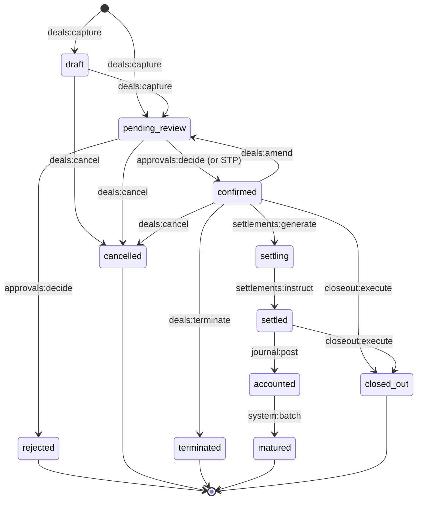

Concepts

<StatusBadge status="draft" reviewed="2026-06-23" />

# Deal state machine

Every deal in OpenTRMS moves through a fixed set of states — `draft`,
`pending_review`, `confirmed`, `settling`, `settled`, `accounted`, `matured`,
`terminated`, `rejected`, `cancelled`, `closed_out` — owned and enforced by
`trms-workflow`. The state machine exists so that every product, regardless
of asset class, follows the same rules about what can happen next and who is
allowed to make it happen. Without a central machine, "can this deal be
amended right now" becomes a question each product module answers
differently, which is exactly the kind of inconsistency that produces
operational risk.

## States and required scope

Each transition is gated by a required scope, not just a status check. A
deal moving from `pending_review` to `confirmed` requires
`approvals:decide` (or passes automatically through
[straight-through processing](/concepts/capture-stp)); moving from
`confirmed` to `settling` requires `settlements:generate`; moving from
`settled` to `accounted` requires `journal:post`; the final
`accounted → matured` transition is driven by the system itself
(`system:batch`) rather than a human action. This means the same transition
table that defines *valid* lifecycle moves also defines *who* can trigger
them — the state machine and the [permission model](/reference/scopes) are
two views of one set of rules.

## Why amendment loops back

`confirmed → pending_review` (via `deals:amend`) is the one transition that
moves a deal *backward*. A confirmed deal that needs amending re-enters
review rather than being mutated in place — the original confirmation event
stays in the log untouched, and the amendment becomes its own event. This
keeps the [event-sourced](/concepts/event-sourcing) guarantee intact: a
deal's current state is always a fold over its full event history, never an
edit to a snapshot.

## Terminal states aren't all equal

`rejected` and `cancelled` end a deal that never took on market risk;
`terminated` and `closed_out` end one that did, and which therefore has
realized P&L, settlement and accounting consequences to resolve (see
[Closeout & compression](/concepts/closeout)). `matured` is the "nothing
went wrong" terminal state — the deal ran its full course. Each transition
into a terminal state appends its own typed event (`deal_rejected`,
`deal_cancelled`, `deal_terminated`, `deal_closed_out`), so the *reason* a
deal stopped moving is always recoverable from the log, not inferred from
its final status alone.

For how a deal gets from capture into the queue this machine governs, see
[Capture & STP](/concepts/capture-stp). For multi-step sign-off on
risk-sensitive transitions, see [Approval chains](/concepts/approval-chains).
