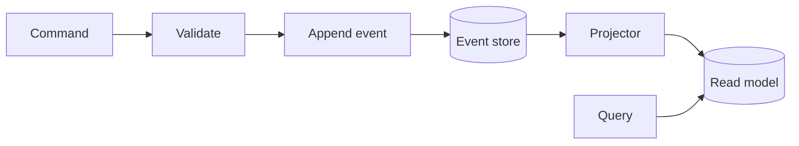

Concepts

<StatusBadge status="draft" reviewed="2026-06-23" />

# Event sourcing & CQRS

OpenTRMS does not store "the current state of a deal" as a row you overwrite.
It stores the sequence of things that happened to that deal — `deal_drafted`,
`deal_submitted`, `deal_confirmed`, `deal_amended`, `deal_terminated`,
`deal_cancelled`, `deal_closed_out` — and derives current state by replaying
that sequence. The same pattern applies to every other aggregate in the
system: instructions, instruments, curves, settlements, payments, journal
entries, valuations, closeout batches, netting sets and approval requests
each have their own typed event vocabulary.

This matters for a trading and risk system specifically because "what did we
believe, and why, at the time we acted" is the question regulators, auditors
and your own risk desk eventually ask. A mutable `deals` table can tell you
where a deal is now; it cannot reliably tell you how it got there. An event
log can — see [Hash chain](/concepts/hash-chain) for how that history is also
made tamper-evident.

## Command/query split (CQRS)

Writes and reads go through different paths. A command — "confirm this
deal," "post this journal entry" — validates, appends one or more events to
the log, and updates a read-optimized projection, all in a single database
transaction. There is no eventual consistency window: by the time the write
call returns, the projection already reflects the new event.

Queries never touch the event log directly. They read from projections —
denormalized, indexed tables shaped for the question being asked (current
deal status, today's valuations, pending approvals) — maintained by
projectors such as the deal, valuation, settlement, payment, journal,
instruction, closeout and netting projectors in `trms-event-store`. Splitting
the model this way means the write path stays simple and append-only while
the read path can be shaped, indexed and rebuilt independently.

## Why replay instead of mutation

Because state is a fold over events, two things fall out for free:
deterministic rebuilds (drop a projection table, replay the log, get the
same answer) and auditability (the event you appended is the event a
regulator can inspect later, byte for byte). The cost is that every state
change must be expressed as an event up front — there's no "just patch the
row" escape hatch.

See [Event store](/concepts/event-store) for the storage mechanics, and
[Deal state machine](/concepts/deal-state-machine) for how deal events map to
lifecycle transitions.
