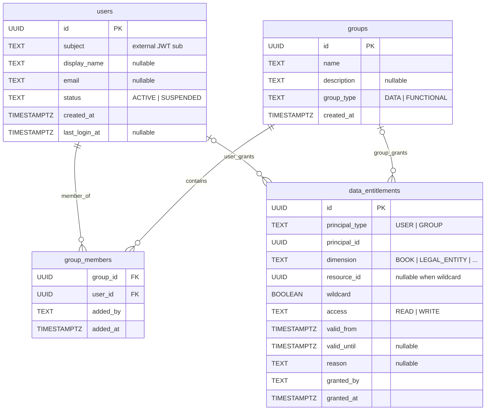
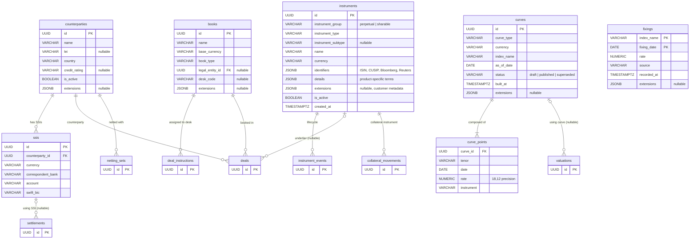
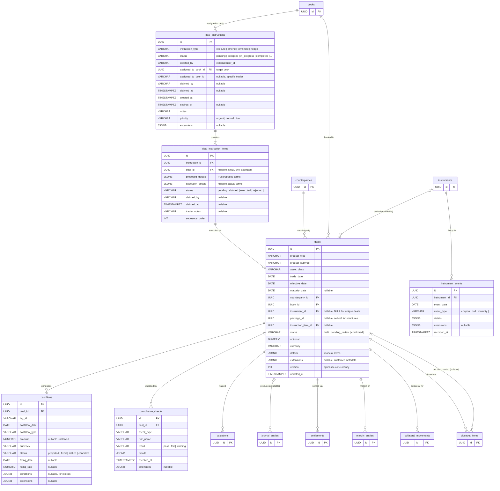
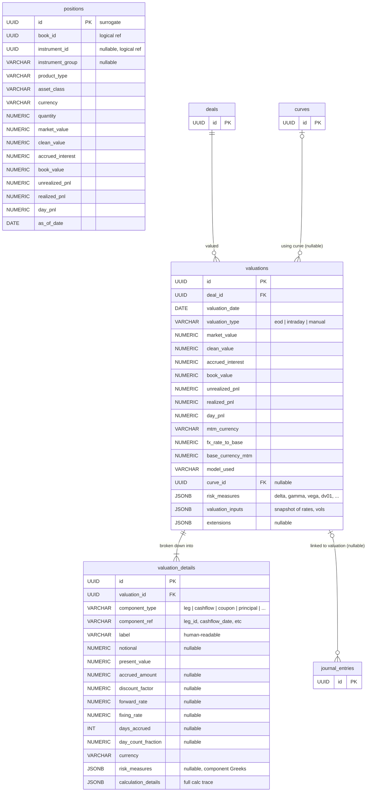
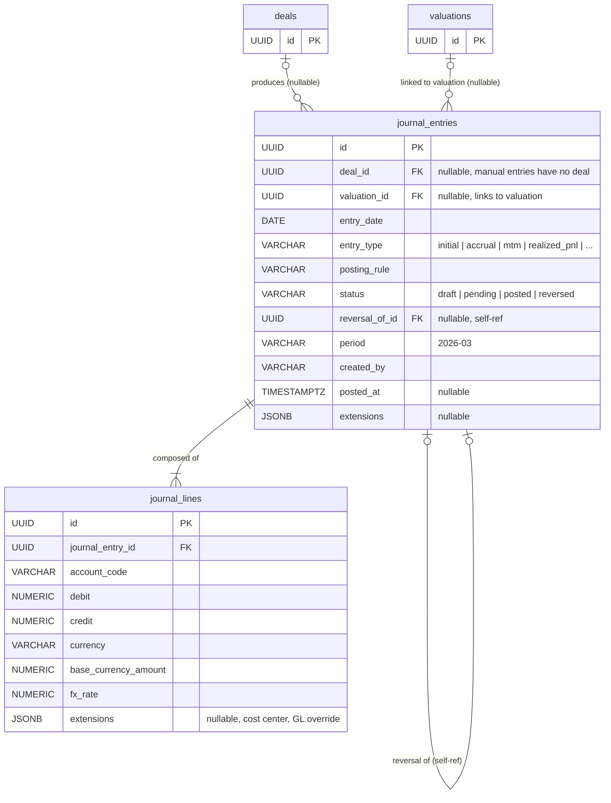
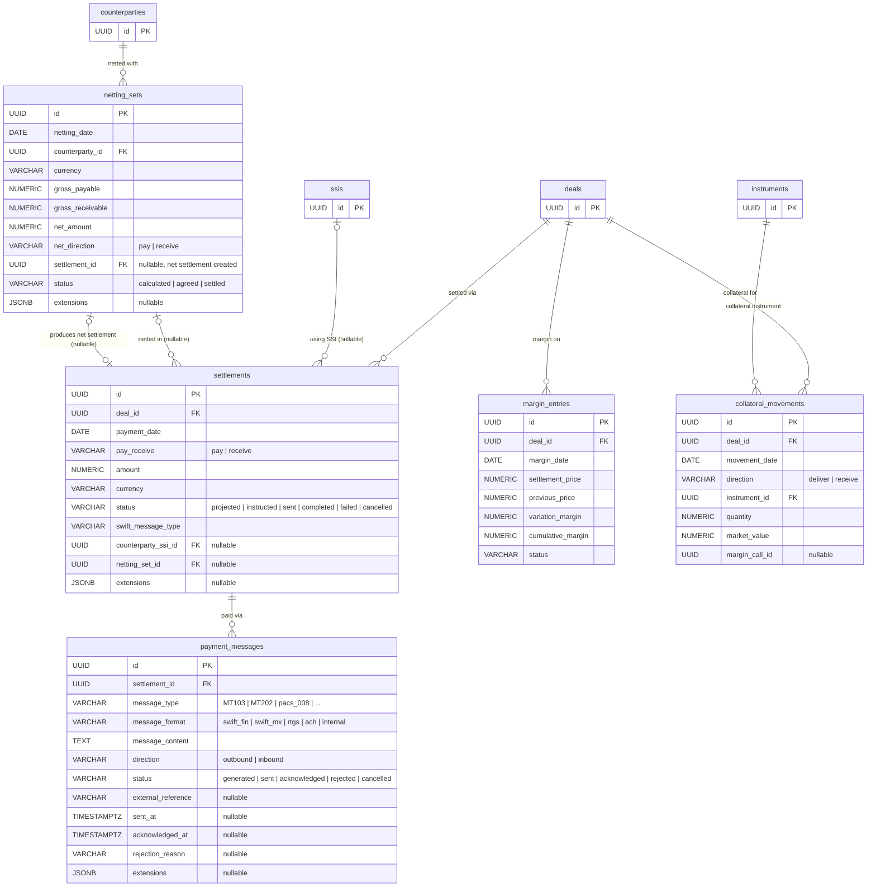
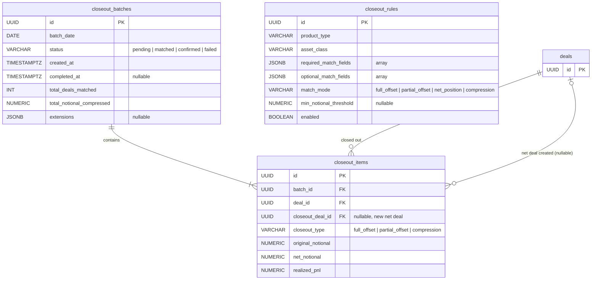
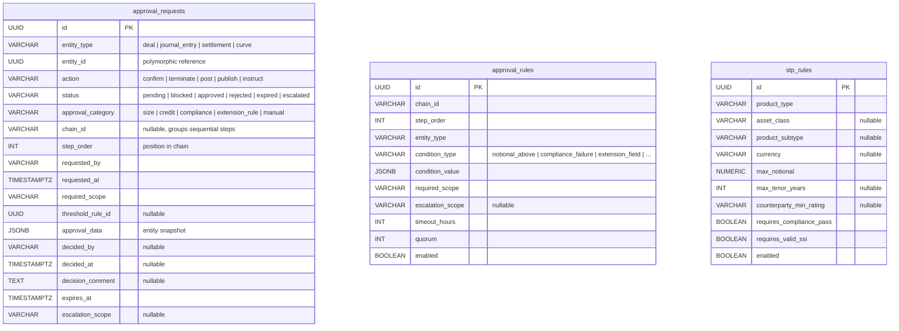
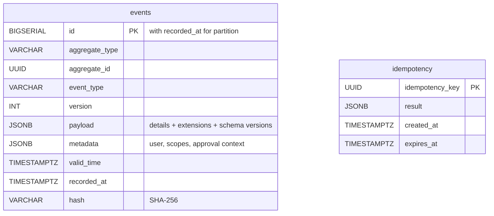

<div className="eyebrow">Reference</div>

# Entity-relationship diagram

<StatusBadge status="draft" reviewed="2026-06-24" />

The full OpenTRMS schema currently spans **41 tables**, so this page
splits the backend ERD into domain slices generated from `docs/ERD.mermaid`.
Each slice keeps the local tables readable and adds one-field stubs when a
foreign-key edge crosses into another domain.

| Domain | Tables |
| --- | ---: |
| AUTHORIZATION | 4 |
| REFERENCE DATA | 7 |
| DEAL LIFECYCLE | 6 |
| VALUATION & P&L | 3 |
| ACCOUNTING | 2 |
| SETTLEMENT & PAYMENT | 5 |
| CLOSEOUT | 3 |
| WORKFLOW | 3 |
| EVENT STORE | 2 |
| AUDIT | 6 |

[Download the full Mermaid source](/erd/trms-erd-full.mermaid)

## Domain slices

{/* AUTO-GENERATED by scripts/sync-from-source.mjs - do not edit; run npm run sync */}

### AUTHORIZATION (4 tables)



### REFERENCE DATA (7 tables)



### DEAL LIFECYCLE (6 tables)



### VALUATION & P&L (3 tables)



### ACCOUNTING (2 tables)



### SETTLEMENT & PAYMENT (5 tables)



### CLOSEOUT (3 tables)



### WORKFLOW (3 tables)



### EVENT STORE (2 tables)



### AUDIT (6 tables)

```mermaid
erDiagram
    %% AUDIT

    user_actions {
        UUID id PK
        VARCHAR user_id
        JSONB user_roles
        VARCHAR action "endpoint + method"
        VARCHAR entity_type
        UUID entity_id "nullable"
        JSONB request_summary
        INT response_status
        VARCHAR ip_address
        VARCHAR client_type
        UUID correlation_id
        TIMESTAMPTZ timestamp
    }

    data_lineage {
        UUID id PK
        VARCHAR entity_type
        UUID entity_id
        VARCHAR field_path
        VARCHAR source_type "valuation | curve | fixing | manual"
        UUID source_id
        JSONB upstream_sources
        TIMESTAMPTZ recorded_at
    }

    reconciliations {
        UUID id PK
        VARCHAR recon_type "position | settlement | gl_balance"
        DATE recon_date
        VARCHAR source_system
        VARCHAR entity_type
        NUMERIC expected_value
        NUMERIC actual_value
        NUMERIC difference
        VARCHAR status "matched | break | explained"
        TEXT explanation "nullable"
        VARCHAR resolved_by "nullable"
        TIMESTAMPTZ resolved_at "nullable"
        JSONB extensions "nullable"
    }

    system_events {
        UUID id PK
        VARCHAR event_type "eod_started | eod_completed | schema_reload | ..."
        JSONB details
        VARCHAR triggered_by "user_id or system"
        TIMESTAMPTZ timestamp
    }

    regulatory_submissions {
        UUID id PK
        VARCHAR submission_type "osfi_capital | mifid_report | emir_report"
        VARCHAR reporting_entity
        DATE reporting_date
        VARCHAR jurisdiction
        VARCHAR content_hash "SHA-256 of submitted data"
        VARCHAR submission_status "prepared | submitted | acknowledged | rejected"
        TIMESTAMPTZ submitted_at "nullable"
        VARCHAR external_reference "nullable"
        JSONB extensions "nullable"
    }

    config_changes {
        UUID id PK
        VARCHAR config_type "role | stp_rule | approval_chain | closeout_rule | schema"
        VARCHAR config_path
        VARCHAR change_type "created | modified | deleted"
        JSONB previous_value "nullable"
        JSONB new_value "nullable"
        VARCHAR changed_by
        TIMESTAMPTZ changed_at
        TEXT reason "nullable"
    }
```



## Full diagram

<details>
  <summary>Expand the full 41-table ERD</summary>

```mermaid
erDiagram
    %% ═══════════════════════════════════════════
    %% TRMS Entity Relationship Diagram (41 tables)
    %% ═══════════════════════════════════════════

    %% ── AUTHORIZATION ───────────────────────────

    users {
        UUID id PK
        TEXT subject "external JWT sub"
        TEXT display_name "nullable"
        TEXT email "nullable"
        TEXT status "ACTIVE | SUSPENDED"
        TIMESTAMPTZ created_at
        TIMESTAMPTZ last_login_at "nullable"
    }

    groups {
        UUID id PK
        TEXT name
        TEXT description "nullable"
        TEXT group_type "DATA | FUNCTIONAL"
        TIMESTAMPTZ created_at
    }

    group_members {
        UUID group_id FK
        UUID user_id FK
        TEXT added_by
        TIMESTAMPTZ added_at
    }

    data_entitlements {
        UUID id PK
        TEXT principal_type "USER | GROUP"
        UUID principal_id
        TEXT dimension "BOOK | LEGAL_ENTITY | ..."
        UUID resource_id "nullable when wildcard"
        BOOLEAN wildcard
        TEXT access "READ | WRITE"
        TIMESTAMPTZ valid_from
        TIMESTAMPTZ valid_until "nullable"
        TEXT reason "nullable"
        TEXT granted_by
        TIMESTAMPTZ granted_at
    }

    %% ── REFERENCE DATA ──────────────────────────

    instruments {
        UUID id PK
        VARCHAR instrument_group "perpetual | sharable"
        VARCHAR instrument_type
        VARCHAR instrument_subtype "nullable"
        VARCHAR name
        VARCHAR currency
        JSONB identifiers "ISIN, CUSIP, Bloomberg, Reuters"
        JSONB details "product-specific terms"
        JSONB extensions "nullable, customer metadata"
        BOOLEAN is_active
        TIMESTAMPTZ created_at
    }

    counterparties {
        UUID id PK
        VARCHAR name
        VARCHAR lei "nullable"
        VARCHAR country
        VARCHAR credit_rating "nullable"
        BOOLEAN is_active
        JSONB extensions "nullable"
    }

    books {
        UUID id PK
        VARCHAR name
        VARCHAR base_currency
        VARCHAR book_type
        UUID legal_entity_id FK "nullable"
        VARCHAR desk_code "nullable"
        JSONB extensions "nullable"
    }

    ssis {
        UUID id PK
        UUID counterparty_id FK
        VARCHAR currency
        VARCHAR correspondent_bank
        VARCHAR account
        VARCHAR swift_bic
    }

    users ||--o{ group_members : member_of
    groups ||--o{ group_members : contains
    users o|--o{ data_entitlements : user_grants
    groups o|--o{ data_entitlements : group_grants

    curves {
        UUID id PK
        VARCHAR curve_type
        VARCHAR currency
        VARCHAR index_name
        DATE as_of_date
        VARCHAR status "draft | published | superseded"
        TIMESTAMPTZ built_at
        JSONB extensions "nullable"
    }

    curve_points {
        UUID curve_id FK
        VARCHAR tenor
        DATE date
        NUMERIC rate "18,12 precision"
        VARCHAR instrument
    }

    fixings {
        VARCHAR index_name PK
        DATE fixing_date PK
        NUMERIC rate
        VARCHAR source
        TIMESTAMPTZ recorded_at
        JSONB extensions "nullable"
    }

    %% ── DEAL LIFECYCLE ──────────────────────────

    deal_instructions {
        UUID id PK
        VARCHAR instruction_type "execute | amend | terminate | hedge"
        VARCHAR status "pending | accepted | in_progress | completed | ..."
        VARCHAR created_by "external user_id"
        UUID assigned_to_book_id FK "target desk"
        VARCHAR assigned_to_user_id "nullable, specific trader"
        VARCHAR claimed_by "nullable"
        TIMESTAMPTZ claimed_at "nullable"
        TIMESTAMPTZ created_at
        TIMESTAMPTZ expires_at "nullable"
        VARCHAR notes
        VARCHAR priority "urgent | normal | low"
        JSONB extensions "nullable"
    }

    deal_instruction_items {
        UUID id PK
        UUID instruction_id FK
        UUID deal_id FK "nullable, NULL until executed"
        JSONB proposed_details "PM proposed terms"
        JSONB execution_details "nullable, actual terms"
        VARCHAR status "pending | claimed | executed | rejected | ..."
        VARCHAR claimed_by "nullable"
        TIMESTAMPTZ claimed_at "nullable"
        VARCHAR trader_notes "nullable"
        INT sequence_order
    }

    deals {
        UUID id PK
        VARCHAR product_type
        VARCHAR product_subtype
        VARCHAR asset_class
        DATE trade_date
        DATE effective_date
        DATE maturity_date "nullable"
        UUID counterparty_id FK
        UUID book_id FK
        UUID instrument_id FK "nullable, NULL for unique deals"
        UUID package_id "nullable, self-ref for structures"
        UUID instruction_item_id FK "nullable"
        VARCHAR status "draft | pending_review | confirmed | ..."
        NUMERIC notional
        VARCHAR currency
        JSONB details "financial terms"
        JSONB extensions "nullable, customer metadata"
        INT version "optimistic concurrency"
        TIMESTAMPTZ updated_at
    }

    instrument_events {
        UUID id PK
        UUID instrument_id FK
        DATE event_date
        VARCHAR event_type "coupon | call | maturity | ..."
        JSONB details
        JSONB extensions "nullable"
        TIMESTAMPTZ recorded_at
    }

    cashflows {
        UUID id PK
        UUID deal_id FK
        VARCHAR leg_id
        DATE cashflow_date
        VARCHAR cashflow_type
        NUMERIC amount "nullable until fixed"
        VARCHAR currency
        VARCHAR status "projected | fixed | settled | cancelled"
        DATE fixing_date "nullable"
        NUMERIC fixing_rate "nullable"
        JSONB conditions "nullable, for exotics"
        JSONB extensions "nullable"
    }

    compliance_checks {
        UUID id PK
        UUID deal_id FK
        VARCHAR check_type
        VARCHAR rule_name
        VARCHAR result "pass | fail | warning"
        JSONB details
        TIMESTAMPTZ checked_at
        JSONB extensions "nullable"
    }

    %% ── VALUATION & P&L ────────────────────────

    valuations {
        UUID id PK
        UUID deal_id FK
        DATE valuation_date
        VARCHAR valuation_type "eod | intraday | manual"
        NUMERIC market_value
        NUMERIC clean_value
        NUMERIC accrued_interest
        NUMERIC book_value
        NUMERIC unrealized_pnl
        NUMERIC realized_pnl
        NUMERIC day_pnl
        VARCHAR mtm_currency
        NUMERIC fx_rate_to_base
        NUMERIC base_currency_mtm
        VARCHAR model_used
        UUID curve_id FK "nullable"
        JSONB risk_measures "delta, gamma, vega, dv01, ..."
        JSONB valuation_inputs "snapshot of rates, vols"
        JSONB extensions "nullable"
    }

    valuation_details {
        UUID id PK
        UUID valuation_id FK
        VARCHAR component_type "leg | cashflow | coupon | principal | ..."
        VARCHAR component_ref "leg_id, cashflow_date, etc"
        VARCHAR label "human-readable"
        NUMERIC notional "nullable"
        NUMERIC present_value
        NUMERIC accrued_amount "nullable"
        NUMERIC discount_factor "nullable"
        NUMERIC forward_rate "nullable"
        NUMERIC fixing_rate "nullable"
        INT days_accrued "nullable"
        NUMERIC day_count_fraction "nullable"
        VARCHAR currency
        JSONB risk_measures "nullable, component Greeks"
        JSONB calculation_details "full calc trace"
    }

    positions {
        UUID id PK "surrogate"
        UUID book_id "logical ref"
        UUID instrument_id "nullable, logical ref"
        VARCHAR instrument_group "nullable"
        VARCHAR product_type
        VARCHAR asset_class
        VARCHAR currency
        NUMERIC quantity
        NUMERIC market_value
        NUMERIC clean_value
        NUMERIC accrued_interest
        NUMERIC book_value
        NUMERIC unrealized_pnl
        NUMERIC realized_pnl
        NUMERIC day_pnl
        DATE as_of_date
    }

    %% ── ACCOUNTING ──────────────────────────────

    journal_entries {
        UUID id PK
        UUID deal_id FK "nullable, manual entries have no deal"
        UUID valuation_id FK "nullable, links to valuation"
        DATE entry_date
        VARCHAR entry_type "initial | accrual | mtm | realized_pnl | ..."
        VARCHAR posting_rule
        VARCHAR status "draft | pending | posted | reversed"
        UUID reversal_of_id FK "nullable, self-ref"
        VARCHAR period "2026-03"
        VARCHAR created_by
        TIMESTAMPTZ posted_at "nullable"
        JSONB extensions "nullable"
    }

    journal_lines {
        UUID id PK
        UUID journal_entry_id FK
        VARCHAR account_code
        NUMERIC debit
        NUMERIC credit
        VARCHAR currency
        NUMERIC base_currency_amount
        NUMERIC fx_rate
        JSONB extensions "nullable, cost center, GL override"
    }

    %% ── SETTLEMENT & PAYMENT ────────────────────

    settlements {
        UUID id PK
        UUID deal_id FK
        DATE payment_date
        VARCHAR pay_receive "pay | receive"
        NUMERIC amount
        VARCHAR currency
        VARCHAR status "projected | instructed | sent | completed | failed | cancelled"
        VARCHAR swift_message_type
        UUID counterparty_ssi_id FK "nullable"
        UUID netting_set_id FK "nullable"
        JSONB extensions "nullable"
    }

    netting_sets {
        UUID id PK
        DATE netting_date
        UUID counterparty_id FK
        VARCHAR currency
        NUMERIC gross_payable
        NUMERIC gross_receivable
        NUMERIC net_amount
        VARCHAR net_direction "pay | receive"
        UUID settlement_id FK "nullable, net settlement created"
        VARCHAR status "calculated | agreed | settled"
        JSONB extensions "nullable"
    }

    payment_messages {
        UUID id PK
        UUID settlement_id FK
        VARCHAR message_type "MT103 | MT202 | pacs_008 | ..."
        VARCHAR message_format "swift_fin | swift_mx | rtgs | ach | internal"
        TEXT message_content
        VARCHAR direction "outbound | inbound"
        VARCHAR status "generated | sent | acknowledged | rejected | cancelled"
        VARCHAR external_reference "nullable"
        TIMESTAMPTZ sent_at "nullable"
        TIMESTAMPTZ acknowledged_at "nullable"
        VARCHAR rejection_reason "nullable"
        JSONB extensions "nullable"
    }

    margin_entries {
        UUID id PK
        UUID deal_id FK
        DATE margin_date
        NUMERIC settlement_price
        NUMERIC previous_price
        NUMERIC variation_margin
        NUMERIC cumulative_margin
        VARCHAR status
    }

    collateral_movements {
        UUID id PK
        UUID deal_id FK
        DATE movement_date
        VARCHAR direction "deliver | receive"
        UUID instrument_id FK
        NUMERIC quantity
        NUMERIC market_value
        UUID margin_call_id "nullable"
    }

    %% ── CLOSEOUT ────────────────────────────────

    closeout_batches {
        UUID id PK
        DATE batch_date
        VARCHAR status "pending | matched | confirmed | failed"
        TIMESTAMPTZ created_at
        TIMESTAMPTZ completed_at "nullable"
        INT total_deals_matched
        NUMERIC total_notional_compressed
        JSONB extensions "nullable"
    }

    closeout_items {
        UUID id PK
        UUID batch_id FK
        UUID deal_id FK
        UUID closeout_deal_id FK "nullable, new net deal"
        VARCHAR closeout_type "full_offset | partial_offset | compression"
        NUMERIC original_notional
        NUMERIC net_notional
        NUMERIC realized_pnl
    }

    closeout_rules {
        UUID id PK
        VARCHAR product_type
        VARCHAR asset_class
        JSONB required_match_fields "array"
        JSONB optional_match_fields "array"
        VARCHAR match_mode "full_offset | partial_offset | net_position | compression"
        NUMERIC min_notional_threshold "nullable"
        BOOLEAN enabled
    }

    %% ── WORKFLOW ────────────────────────────────

    approval_requests {
        UUID id PK
        VARCHAR entity_type "deal | journal_entry | settlement | curve"
        UUID entity_id "polymorphic reference"
        VARCHAR action "confirm | terminate | post | publish | instruct"
        VARCHAR status "pending | blocked | approved | rejected | expired | escalated"
        VARCHAR approval_category "size | credit | compliance | extension_rule | manual"
        VARCHAR chain_id "nullable, groups sequential steps"
        INT step_order "position in chain"
        VARCHAR requested_by
        TIMESTAMPTZ requested_at
        VARCHAR required_scope
        UUID threshold_rule_id "nullable"
        JSONB approval_data "entity snapshot"
        VARCHAR decided_by "nullable"
        TIMESTAMPTZ decided_at "nullable"
        TEXT decision_comment "nullable"
        TIMESTAMPTZ expires_at
        VARCHAR escalation_scope "nullable"
    }

    approval_rules {
        UUID id PK
        VARCHAR chain_id
        INT step_order
        VARCHAR entity_type
        VARCHAR condition_type "notional_above | compliance_failure | extension_field | ..."
        JSONB condition_value
        VARCHAR required_scope
        VARCHAR escalation_scope "nullable"
        INT timeout_hours
        INT quorum
        BOOLEAN enabled
    }

    stp_rules {
        UUID id PK
        VARCHAR product_type
        VARCHAR asset_class "nullable"
        VARCHAR product_subtype "nullable"
        VARCHAR currency "nullable"
        NUMERIC max_notional
        INT max_tenor_years "nullable"
        VARCHAR counterparty_min_rating "nullable"
        BOOLEAN requires_compliance_pass
        BOOLEAN requires_valid_ssi
        BOOLEAN enabled
    }

    %% ── EVENT STORE ─────────────────────────────

    events {
        BIGSERIAL id PK "with recorded_at for partition"
        VARCHAR aggregate_type
        UUID aggregate_id
        VARCHAR event_type
        INT version
        JSONB payload "details + extensions + schema versions"
        JSONB metadata "user, scopes, approval context"
        TIMESTAMPTZ valid_time
        TIMESTAMPTZ recorded_at
        VARCHAR hash "SHA-256"
    }

    idempotency {
        UUID idempotency_key PK
        JSONB result
        TIMESTAMPTZ created_at
        TIMESTAMPTZ expires_at
    }

    %% ── AUDIT ───────────────────────────────────

    user_actions {
        UUID id PK
        VARCHAR user_id
        JSONB user_roles
        VARCHAR action "endpoint + method"
        VARCHAR entity_type
        UUID entity_id "nullable"
        JSONB request_summary
        INT response_status
        VARCHAR ip_address
        VARCHAR client_type
        UUID correlation_id
        TIMESTAMPTZ timestamp
    }

    data_lineage {
        UUID id PK
        VARCHAR entity_type
        UUID entity_id
        VARCHAR field_path
        VARCHAR source_type "valuation | curve | fixing | manual"
        UUID source_id
        JSONB upstream_sources
        TIMESTAMPTZ recorded_at
    }

    reconciliations {
        UUID id PK
        VARCHAR recon_type "position | settlement | gl_balance"
        DATE recon_date
        VARCHAR source_system
        VARCHAR entity_type
        NUMERIC expected_value
        NUMERIC actual_value
        NUMERIC difference
        VARCHAR status "matched | break | explained"
        TEXT explanation "nullable"
        VARCHAR resolved_by "nullable"
        TIMESTAMPTZ resolved_at "nullable"
        JSONB extensions "nullable"
    }

    system_events {
        UUID id PK
        VARCHAR event_type "eod_started | eod_completed | schema_reload | ..."
        JSONB details
        VARCHAR triggered_by "user_id or system"
        TIMESTAMPTZ timestamp
    }

    regulatory_submissions {
        UUID id PK
        VARCHAR submission_type "osfi_capital | mifid_report | emir_report"
        VARCHAR reporting_entity
        DATE reporting_date
        VARCHAR jurisdiction
        VARCHAR content_hash "SHA-256 of submitted data"
        VARCHAR submission_status "prepared | submitted | acknowledged | rejected"
        TIMESTAMPTZ submitted_at "nullable"
        VARCHAR external_reference "nullable"
        JSONB extensions "nullable"
    }

    config_changes {
        UUID id PK
        VARCHAR config_type "role | stp_rule | approval_chain | closeout_rule | schema"
        VARCHAR config_path
        VARCHAR change_type "created | modified | deleted"
        JSONB previous_value "nullable"
        JSONB new_value "nullable"
        VARCHAR changed_by
        TIMESTAMPTZ changed_at
        TEXT reason "nullable"
    }

    %% ═══════════════════════════════════════════
    %% RELATIONSHIPS
    %% ═══════════════════════════════════════════

    %% Reference Data
    counterparties ||--o{ ssis : "has SSIs"
    curves ||--|{ curve_points : "composed of"
    instruments ||--o{ instrument_events : "lifecycle"

    %% Instructions → Deals
    books ||--o{ deal_instructions : "assigned to desk"
    deal_instructions ||--|{ deal_instruction_items : "contains"
    deal_instruction_items ||--o| deals : "executed as"

    %% Deal core relationships
    counterparties ||--o{ deals : "counterparty"
    books ||--o{ deals : "booked in"
    instruments |o--o{ deals : "underlier (nullable)"
    deals ||--o{ cashflows : "generates"
    deals ||--o{ compliance_checks : "checked by"

    %% Valuation
    deals ||--o{ valuations : "valued"
    curves |o--o{ valuations : "using curve (nullable)"
    valuations ||--|{ valuation_details : "broken down into"

    %% Accounting
    deals |o--o{ journal_entries : "produces (nullable)"
    valuations |o--o{ journal_entries : "linked to valuation (nullable)"
    journal_entries |o--o| journal_entries : "reversal of (self-ref)"
    journal_entries ||--|{ journal_lines : "composed of"

    %% Settlement chain
    deals ||--o{ settlements : "settled via"
    ssis |o--o{ settlements : "using SSI (nullable)"
    netting_sets |o--o{ settlements : "netted in (nullable)"
    settlements ||--o{ payment_messages : "paid via"
    counterparties ||--o{ netting_sets : "netted with"
    netting_sets |o--o| settlements : "produces net settlement (nullable)"

    %% Margin & Collateral
    deals ||--o{ margin_entries : "margin on"
    deals ||--o{ collateral_movements : "collateral for"
    instruments ||--o{ collateral_movements : "collateral instrument"

    %% Closeout
    closeout_batches ||--|{ closeout_items : "contains"
    deals ||--o{ closeout_items : "closed out"
    deals |o--o{ closeout_items : "net deal created (nullable)"
```

</details>
